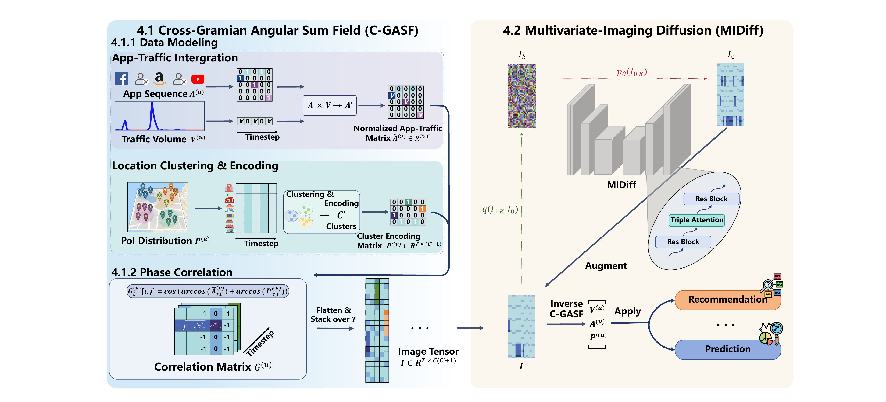

# MIDiff

Official implementation of **MIDiff: Tackling Sparsity and Imbalance in Mobile Usage Generation via Multivariate-Imaging Diffusion**.

MIDiff is a diffusion-based framework for generating user-level mobile usage traces. It converts sparse multivariate traces into Cross-Gramian Angular Sum Field (C-GASF) images, trains a Triple-Attention U-Net diffusion model in the image space, and converts generated images back to mobile usage sequences.

<p align="center">
  
</p>

## Installation

```bash
git clone https://github.com/YilaiLiu-HKU/MIDiff.git
cd MIDiff
python -m pip install -r requirements.txt
```

The requirements file is a minimal list filtered from the `posster` environment for this repository. The code is script-based and is intended to be run from the repository root. It is based on OpenAI Guided Diffusion and PyTorch.

## Dataset

The original data is available from the [Tsinghua App Usage Dataset](https://fi.ee.tsinghua.edu.cn/appusage/). This repository does not redistribute the dataset; please follow the original dataset terms.

Place processed data and checkpoints under:

```text
data/
  our.csv
  dataset_original_npz/all_users_data_with6cluster.npz
cgasf/
ckpt/midiff/
```

`data/our.csv` is the real/reference CSV in flattened `[192, 3]` eval format, and `cgasf/` contains C-GASF training images.

The paper checkpoint is hosted on Hugging Face and is not stored in Git. Download it with:

```bash
huggingface-cli download no-pressure/MIDiff ckpt/midiff/ema_0.9999_048000.pt --local-dir .
```

## Usage

Train MIDiff:

```bash
bash run_scripts/train_midiff.sh
```

Sample C-GASF images from the paper checkpoint:

```bash
bash run_scripts/sample_midiff.sh
```

Convert the sampled NPZ into eval-format CSV:

```bash
bash run_scripts/infer_npz_to_eval_csv.sh
```

Evaluate generated traces:

```bash
bash run_scripts/evaluate_midiff_real.sh
```

Run the default experiment pipeline:

```bash
bash run_scripts/run_all_midiff_exp.sh
```

Downstream tasks are disabled by default because they are more expensive. Enable them with:

```bash
RUN_DOWNSTREAM=1 bash run_scripts/run_all_midiff_exp.sh
```

## Key Scripts

- `gasf_cross_conversion.py`: C-GASF forward transform.
- `gasf_cross_conversion_inverse.py`: inverse C-GASF recovery.
- `train_midiff.py`: diffusion training entrypoint.
- `sample_midiff.py`: diffusion sampling entrypoint.
- `exp/evaluate_generation_metrics.py`: generation metrics.
- `exp/run_downstream_cross_variable.py`: downstream utility tasks.

## Citation

If you use this code, please cite:

```bibtex
@misc{midiff2026,
  title = {MIDiff: Tackling Sparsity and Imbalance in Mobile Usage Generation via Multivariate-Imaging Diffusion},
  author = {Yilai Liu and Shiyuan Zhang and Hongyang Du},
  year = {2026}
}
```

## Acknowledgements

This implementation builds on OpenAI Guided Diffusion.
